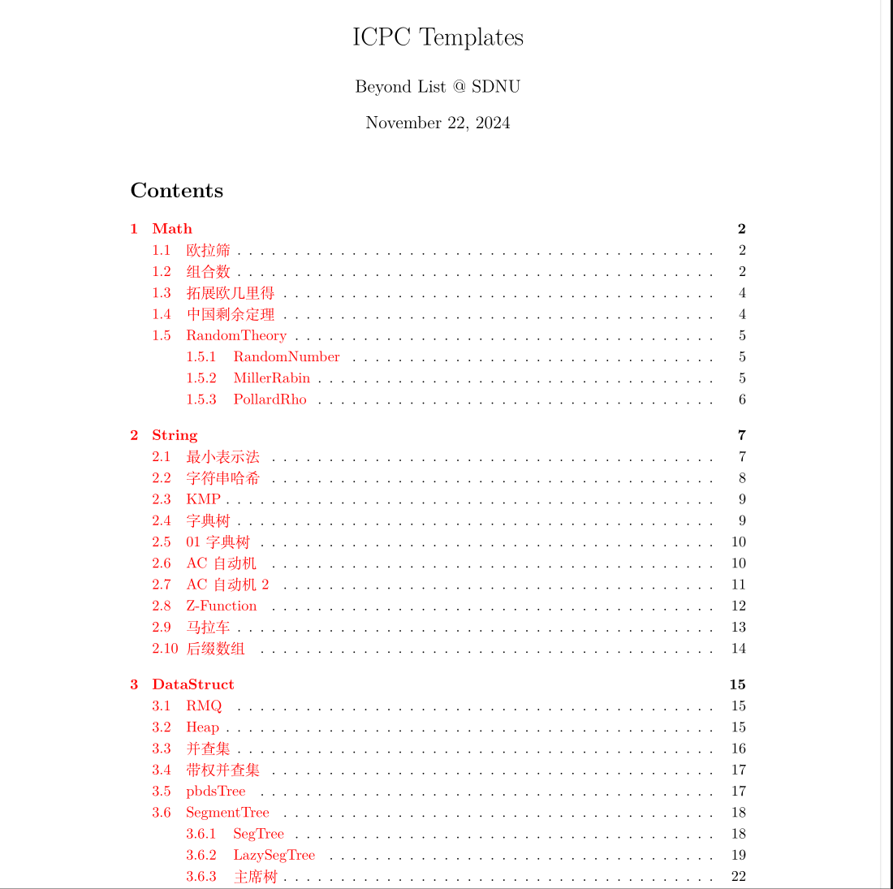
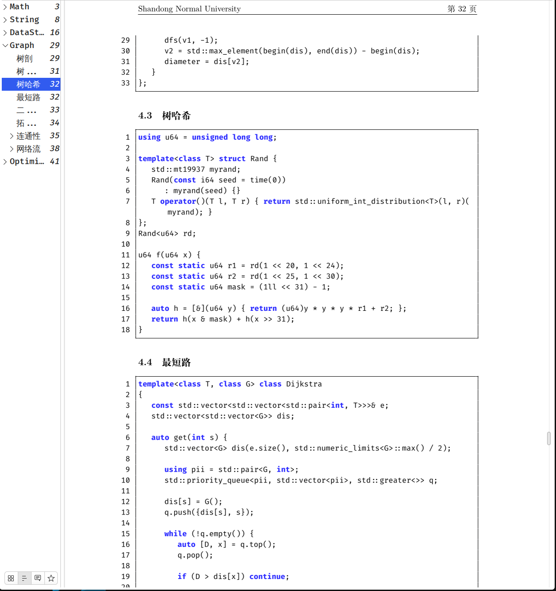

# Algo-Template

A latex-based algorithm templates for ICPC competitions. Only used for **Personal.**

<!--  -->
<!--  -->

<div style="display: flex;">
  
  
</div>

You can check out the demo [here](https://github.com/GEJXD/Algo-template/blob/master/resource/template.pdf).

> The demo algorithm template are mostly copy from [this repo](https://www.yuque.com/capps/ze6wk1/heb78p9y3xvyrpz9?singleDoc#hJ67o), for preview and example only.

## 🪷 Features

- Module independent, content configured via `config` file.
- Chinese Support.
- Brief PDF structure, easy to find.

## 📦 Requirements

- Tex-Live
- g++ compiler (Theoretically any C++ compiler will work, but it's untested.)
- make

## 🧭 Usage

### 1.Install dependences:

**For Arch linux:**
```bash
sudo pacman -S make g++
yay -S texlive-full
```

**For Ubuntu:**
```bash
sudo apt-get install texlive-full
sudo apt-get install build-essential
```

**For other distributions:**

Refer to the documentation for each distribution.

After the installation is complete, enter the following code to check if the installation was successful.
```bash
make --version
g++ --version
latex --version
```

If successful, you should see output similar to the following.
```bash
GNU Make 4.4.1
为 x86_64-pc-linux-gnu 编译
Copyright (C) 1988-2023 Free Software Foundation, Inc.
License GPLv3+: GNU GPL version 3 or later <https://gnu.org/licenses/gpl.html>
This is free software: you are free to change and redistribute it.
There is NO WARRANTY, to the extent permitted by law.

g++ (GCC) 14.2.1 20240910
Copyright © 2024 Free Software Foundation, Inc.
本程序是自由软件；请参看源代码的版权声明。本软件没有任何担保；
包括没有适销性和某一专用目的下的适用性担保。

pdfTeX 3.141592653-2.6-1.40.26 (TeX Live 2024/Arch Linux)
kpathsea version 6.4.0
Copyright 2024 Han The Thanh (pdfTeX) et al.
There is NO warranty.  Redistribution of this software is
covered by the terms of both the pdfTeX copyright and
the Lesser GNU General Public License.
For more information about these matters, see the file
named COPYING and the pdfTeX source.
Primary author of pdfTeX: Han The Thanh (pdfTeX) et al.
Compiled with libpng 1.6.44; using libpng 1.6.44
Compiled with zlib 1.3.1; using zlib 1.3.1
Compiled with xpdf version 4.04
```

### Clone

Use `git clone` to clone the project locally.
```bash
git clone git@github.com:GEJXD/Algo-template.git.
cd Algo-templatee
```

### Edit your template

You can change the author, title, etc. attributes of `head.tex.

The `config` file in the root directory of this project is a configuration file for a first-level directory, mainly used to control the output of Section. The internal name represents a first-level directory. The name needs to be changed by the user. **Note that the subfolder name should same as the `config` file.**

The config in each first-level subfolder is used to configure the output of the subsection and whether or not there is a subsubsection. Format are as follow:

- `<subsection name> <code file> <tex file> <subsubsection name>`
- subsection name: fill in the name of the desired Subsection inside the <>.
- code file: The code file corresponding to the current subsection.
- tex file: The description file corresponding to the current subsection
- If you need a subsubsection, then you only need to fill in the subsection with the same name as <subsubsection name>. **Note that the second and third parameters need to be left blank at this point. see `Math/config` and `Math/RandomTheory/config`.** 
- The configuration of the config file in the subsubsection is the same as above. **Note that there are no support for subsubsubsection :(.**

### Comlile

just run the command `make` at the root directory of the project.

after that you will see a lot of log output. If you see output similar to the following:
```bash
Output written on template.pdf (42 pages).
Transcript written on template.log.
```

the `template.pdf` are the result.
you can run the `make clean` command to clean.
